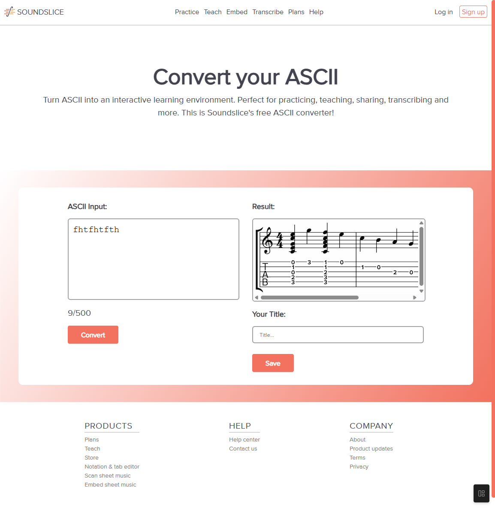

Ontwerp en maak een responsive website voor een startup.

De instructies voor deze opdracht staan in: [INSTRUCTIONS.md](https://github.com/fdnd-task/the-startup-responsive-interactieve-website/blob/main/docs/INSTRUCTIONS.md)

# Titel
Soundslice ASCCII converter.

## Beschrijving
Een website die ascii tekst converteert naar een riff sheet.

## Kenmerken
- Responsive design
- Interactieve elementen
- Gebruiksvriendelijke interface

gemaakt met HTML, CSS en JavaScript.

## pictures
Desktop view:

Mobile view:

## Licentie

This project is licensed under the terms of the [MIT license](./LICENSE).

